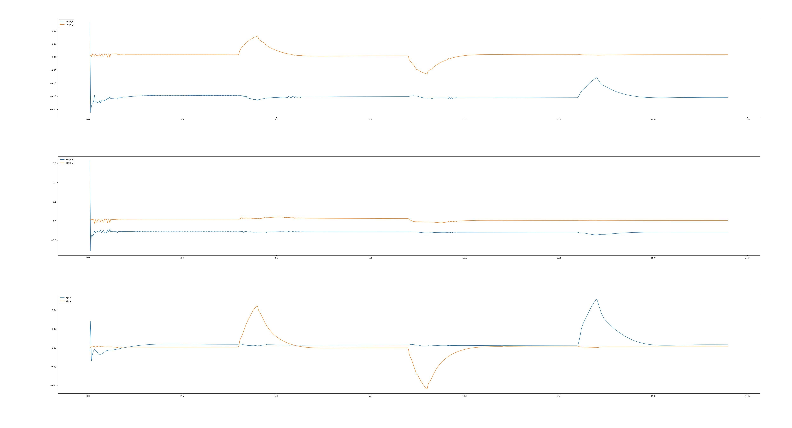
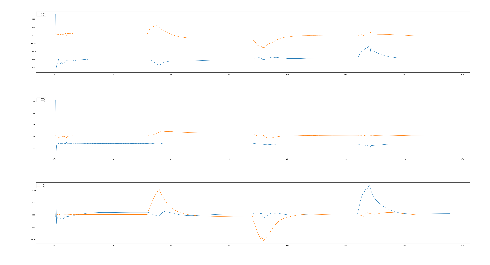
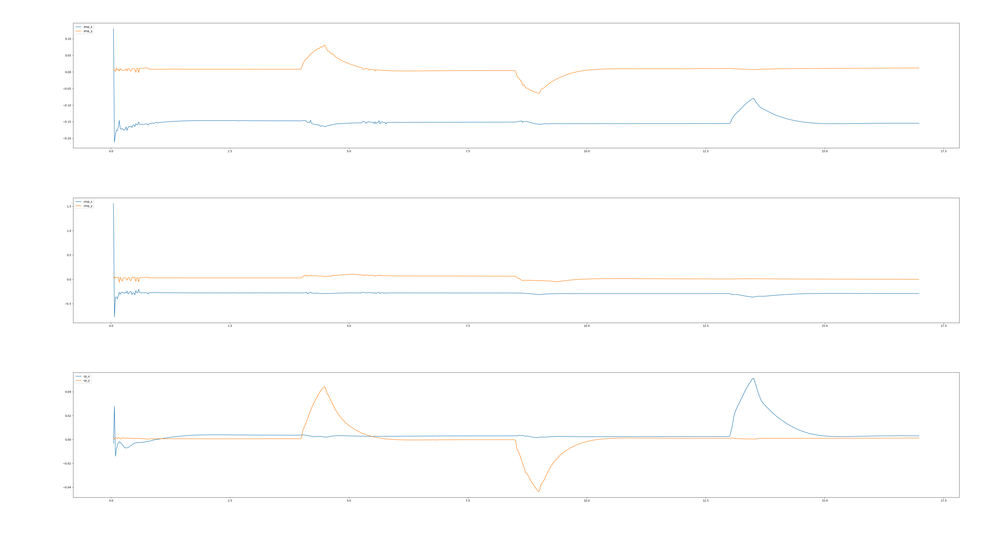
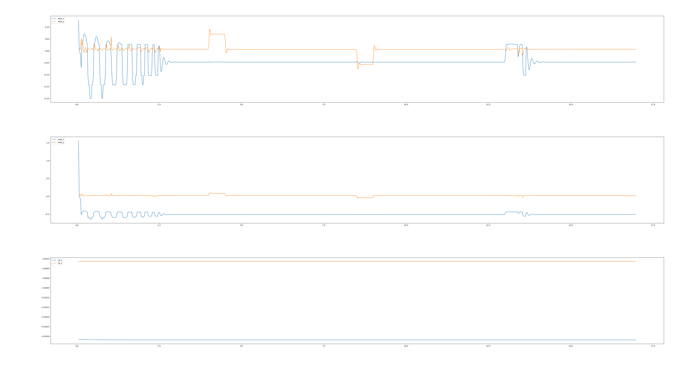
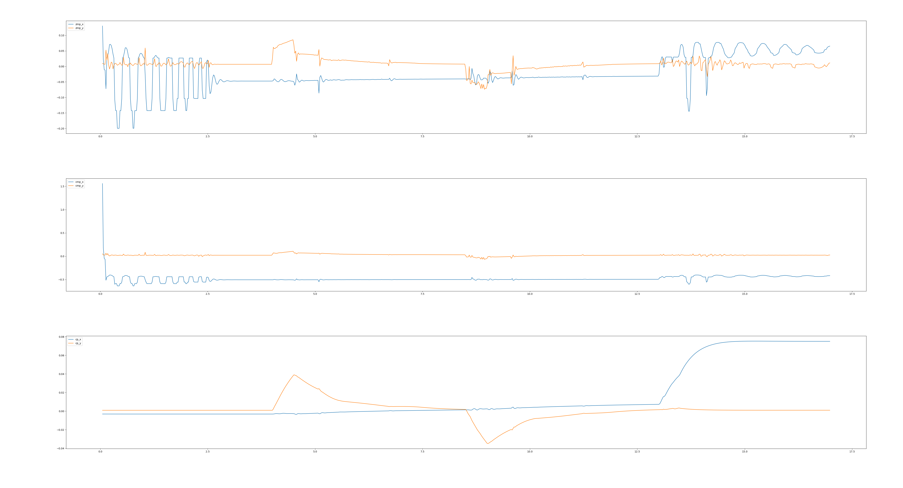
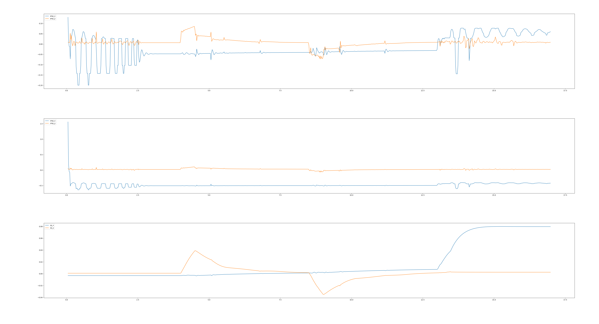

# Report

## Questions in Tutorial 6

**e4: Which ones of the ground reference points can exist outside the supporting polygon?**

Both Centroidal Moment Pivot and Capture point can exist outside the supporting polygon.

**e5: Which modality holds higher pushing forces, torque or position hardware interface?**

A2: Torque modality can holds higher external force than the other.

**e6: Are the torque and position control modalities equivalent with the proposed method? if not, why?**

A3: No, torque control can directly access the torque, which is more intuitive and more precise.

## Plottings in Tutorial 6

### Torque modality

**no balance strategy:**

**ankle strategy:**

**hip strategy:**

**combined strategy:**

### Position modality

**no balance strategy:**

**ankle strategy:**

**hip strategy:**

**combined strategy:**

